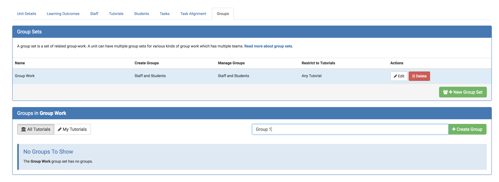
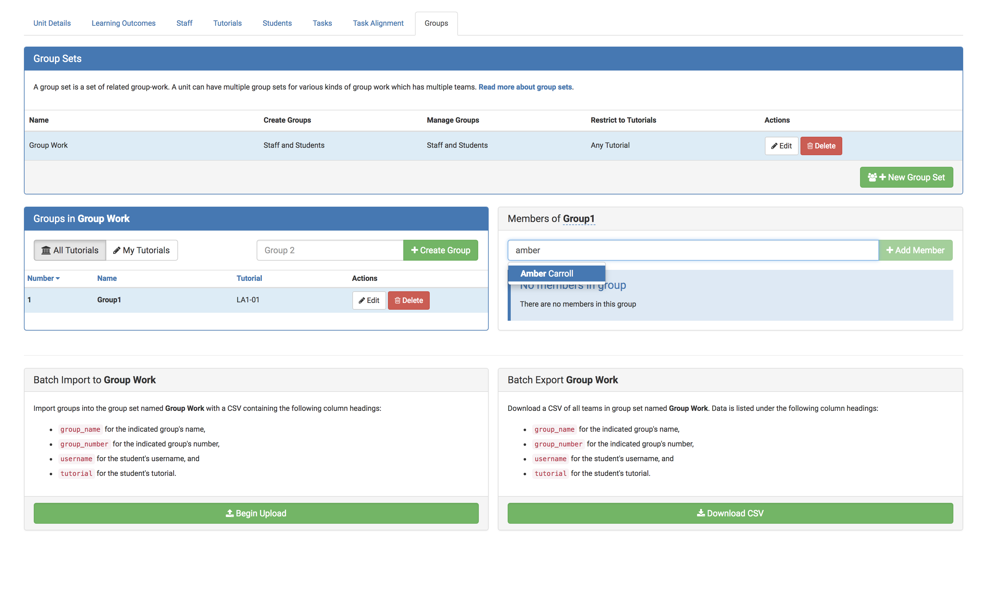

You need to create a group set for each different type of group work that you will have in the unit.

Inside each group set you can then add the different student groups. If you set a task to be related to a group set, then there is one submission per student group and students cannot submit if they are not in a group.

### Creating group sets

1. First select the green icon labeled "+ New Group Set":
   

2. Edit the options for the group set:

   Under **Name** Write the name of the group set, by default this is called "Group Work" but you can change this name.
   
   Under **Create Groups** Choose who will be able to create new groups in the group work set. The drop down menu allows you to select either staff only or staff and students.
   
   Under **Manage Groups** Choose who will be able to manage student groups in this group work set. The drop down menu allows you to select either staff only or staff and students. 
   
   Under **Restrict to Tutorials** Choose who will be able to form groups. The drop down menu allows you to select either same tutorial or any tutorial.
 
3. Save!
   

### Creating student groups within a group set

1. Create a group of students in the group set by typing a group name, and selecting on the green icon labeled "+ Create Group":
   
 

2. Edit the options for the group set:

   Under **Name** Write the name of the group.
   Under **Tutorial** Choose tutorials.
   Under **Capacity Adjustment** Choose how many students each group can have.
 
3. Add students to the group by typing the student name:

   

#### Note:
You can also export and import CSV files for batch group allocation. To view the correct format of the CSV file for import, you can export the CSV by selecting "Download CSV".
