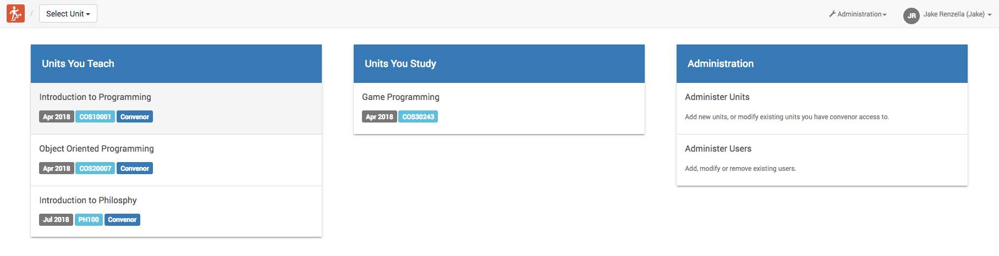
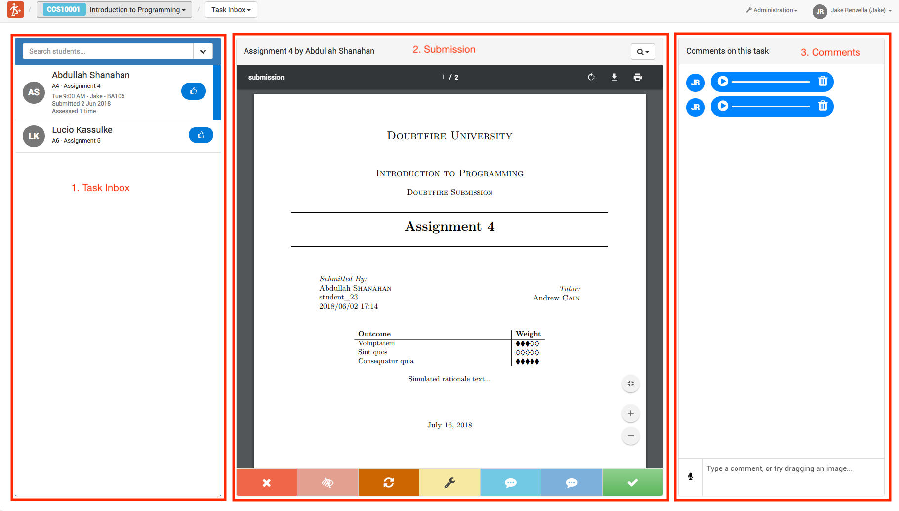
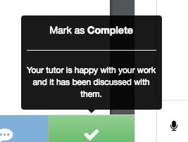
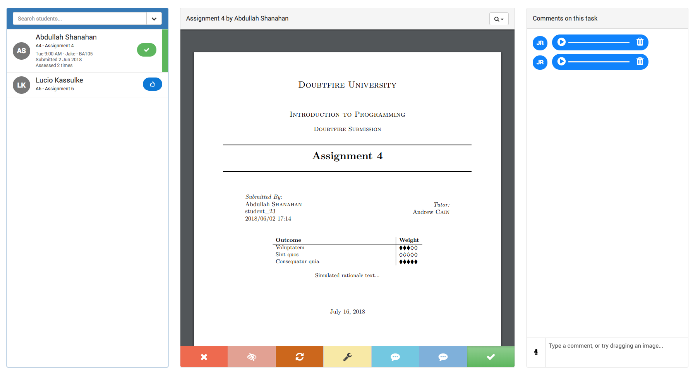

Providing feedback to student submissions in OnTrack is done on the "Task Inbox" page.

1. Log in to OnTrack and select the unit from the "Units You Teach" list, visit its task inbox:

   

2. The task inbox is divided into 3 panels:

   1. Task List, the left panel
   2. The Submission, the center panel
   3. The Comments, the right panel.

   

3. To mark a submission, select the task from the task list, and view the submission in the center panel. There are a
   number of possible states you can place the task on, which are located on the bottom of the submission panel. In
   sequence of appearance these include:

   - Fail
   - Mark As Feedback Exceeded
   - Redo
   - Fix and Resubmit
   - Discuss
   - Demonstrate
   - Complete

   A description of each of these states can be read by hovering your mouse over the state:

   

4. Select the desired state for the submission, and the state will instantly be updated:

   

5. Leave a comment. At any time during this process, you can leave a written, audio or image comment on the task. These
   comments are specific to each individual task between the teaching staff and the student. To leave an audio comment,
   simply click the _microphone_ icon, and click "record". Ensure you are using a modern browser if audio comments are
   not working. Image comments can be uploaded by dragging the image into the comment field, and clicking send.
