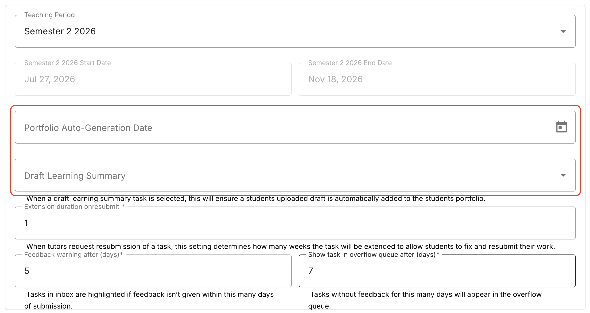
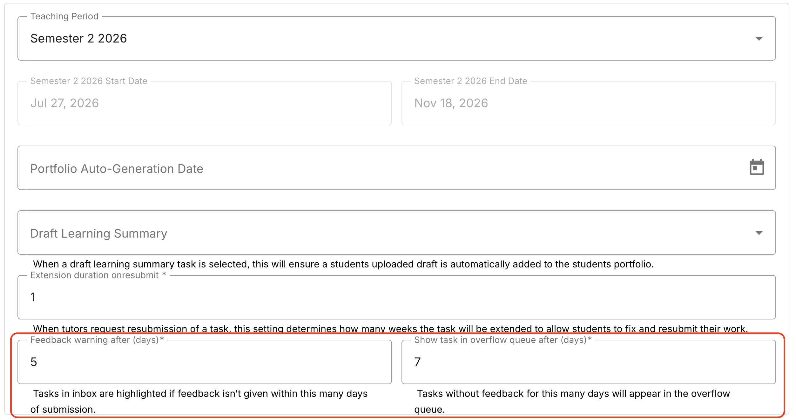
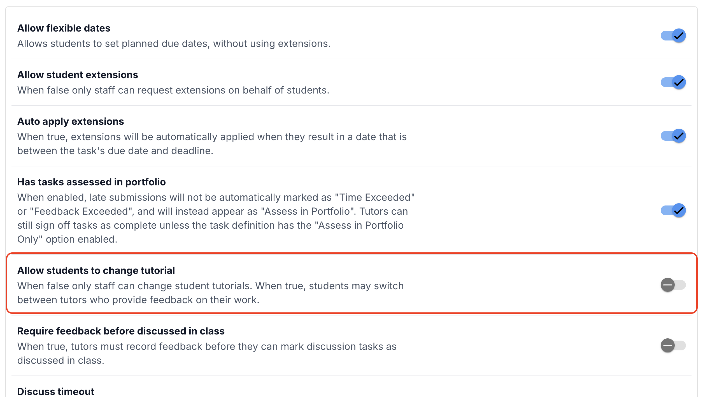
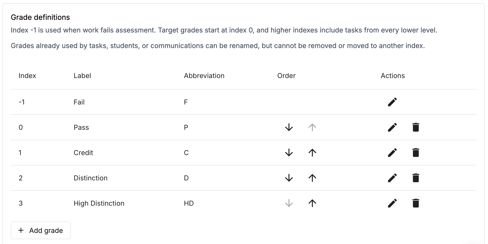

When your OnTrack unit shell is first provisioned for a semester, configure your default operational rules.

### Step-by-step instructions

1. Open your unit's main dashboard in OnTrack.
2. Navigate to Administration > Unit Settings.
3. Configure Portfolio Auto-Generation:
   1. Select your final required Pass task (e.g., Learning Summary Report) in the portfolio dropdown.
4. Set the Auto-Generation Date. Students who have submitted this task will automatically have their final portfolio created on this date as a fail-safe.

5. Set Feedback Thresholds (Overflow Warnings):
 Yellow Warning Threshold (e.g., 4 days): Sets the number of days after submission before a task turns yellow in the assigned TA's inbox to alert them feedback is nearly overdue.
    Red / Overflow Threshold (e.g., 5 days): Sets the threshold after which the task turns red and escalates to the shared Overflow Queue for other staff members to assist.

6. Disable Tutorial Switching: Ensure the checkbox "Allow students to change tutorial" is unticked.
Why: Keeping this ticked allows students to re-assign themselves between tutorial sections, disrupting attendance and TA assignment queues.

7. (Optional) Customise Grade Descriptions:
    If your unit requires non-standard grade names (e.g., High Distinction Plus), modify or append the standard grade names in the grade definition list.

