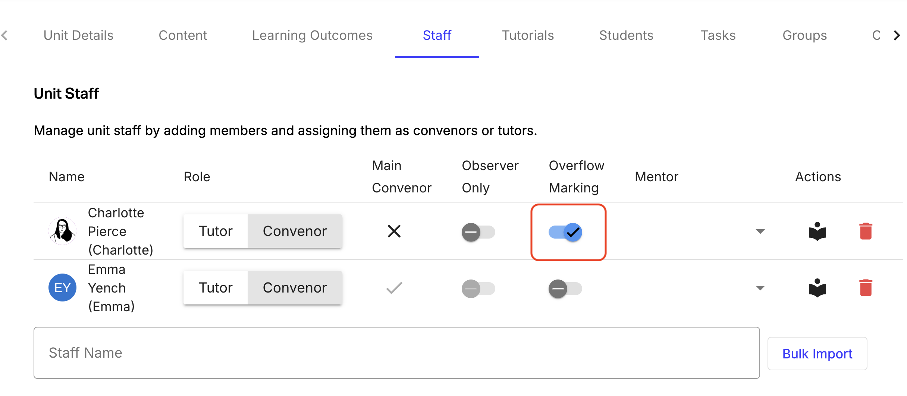
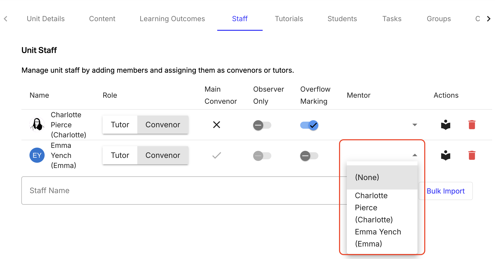
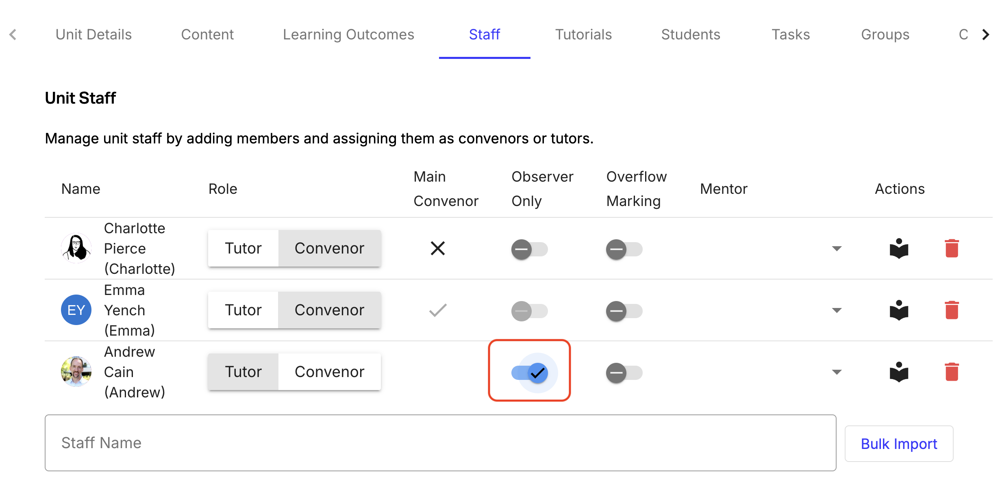

Staff members must log into OnTrack at least once to automatically create their profile in the system before they can be assigned to a unit.

User Roles Overview:
Tutor (Default): Assigned to all staff upon first login. Allows staff to view all students and their submissions, provide feedback, update task statuses, view and grade portfolios, and be assigned to classes/students.
Convener: All tutor permissions, plus full access to unit settings. Staff profiles must be upgraded by an Admin before they can be given this role in a unit.
Observer Toggle: Makes any role read-only (allows viewing settings and submissions without ability to edit).
Overflow Toggle: Enables staff to claim and give feedback on submissions waiting in the central overflow queue.
Mentor Dropdown: Connects a senior staff member to a tutor for feedback moderation.

### Step-by-step instructions

1. Direct all new TAs and staff to log into OnTrack once before the semester starts.
2. Navigate to Admin Panel > Staff.
3. Search for the name of the staff member you want to add in the search bar at the bottom. Click their name to add them to the unit.
4. Assign privileges:
   1. Toggle Overflow Marking ON for TAs who will assist with late feedback.

   2. Select a Mentor from the dropdown menu for junior TAs requiring feedback supervision.

   3. Toggle Observer ON if adding visitors, auditing staff, or observers.

