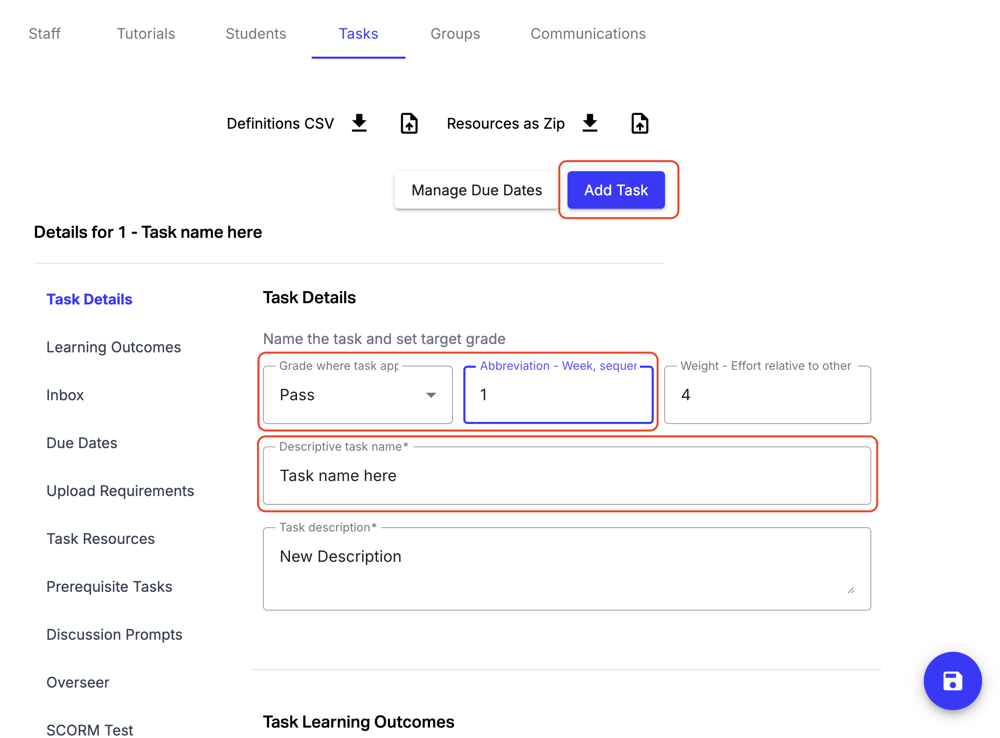
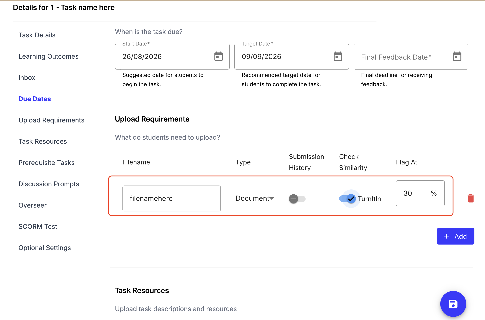
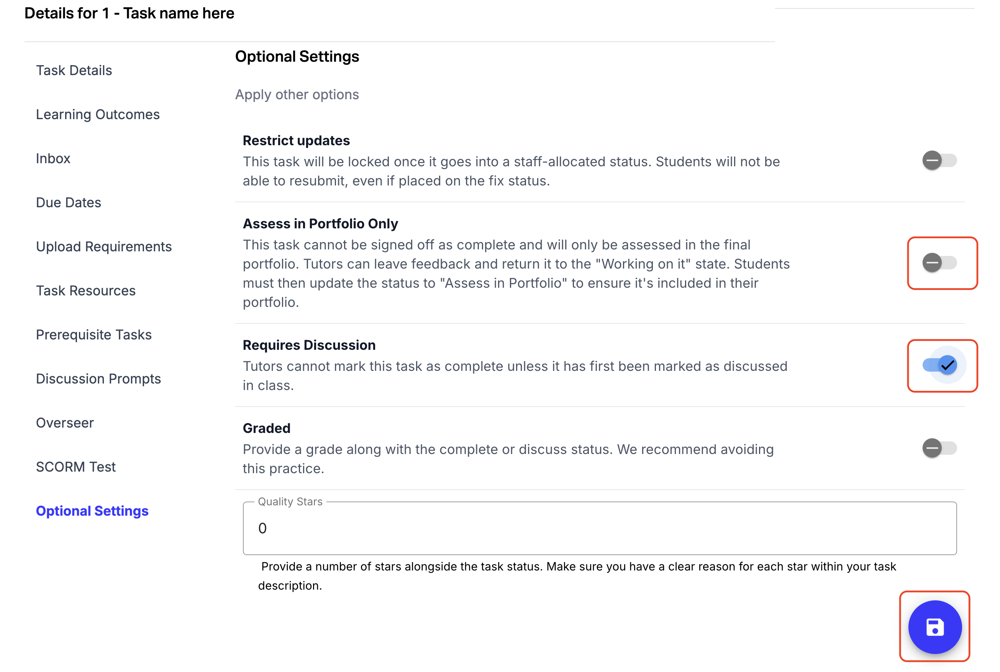
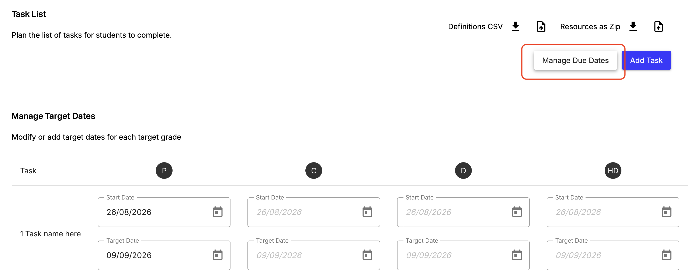

Tasks represent individual learning activities. A student’s final portfolio in OnTrack is a collection of every task they have completed or attempted, as well as the feedback discussions they have had with teaching staff within OnTrack.

### Step-by-step instructions

1. Navigate to Admin > Tasks > Add Task.
2. Task Details:
Enter the Task Name and Abbreviation/Sequence (e.g., 1.1 or Task 01).
Select target Grade Level (Pass, Credit, Distinction, High Distinction).

3. Upload Requirements:
- Add file name
- Select required file format: Code, PDF, Image, or ZIP file (maximum file size: 20 MB).
- Specify a filename (e.g., portfolio_piece.zip) – this can be used to refer to the files students have submitted within other OnTrack systems.
- If you wish to have it scanned for plagiarism detection, toggle on Check Similarity and select your flag percentage.

4. Optional Settings Toggles:
- Requires Discussion: Tick this if students must discuss their work in-person during class. This forces sign-off via QR code in class and prevents TAs from marking it remotely from a desktop.
- Assess in Portfolio Only: Tick this for capstone/HD tasks or learning summaries. When students submit, they will be prompted: "Do you want feedback, or are you done?" (No sign-off required during semester if they are done).

5. Save your task

6. Set Due Dates by Grade:
- Click Manage Due Dates.
- Define Target Start Date, Target Submission Date, and Latest Date (date by which the task must be submitted to receive feedback) for each target grade tier.

