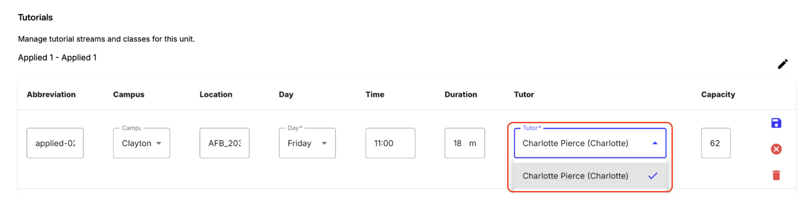
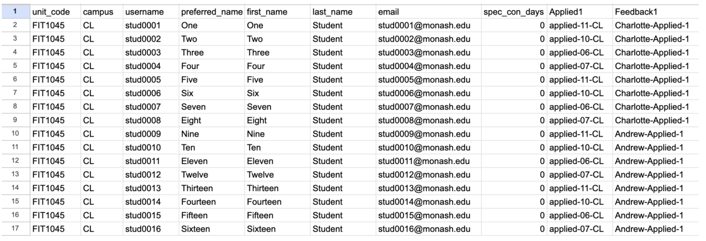

To assign students to specific TAs for feedback, you need to set up feedback streams.

### Step-by-step instructions

1. Ensure all students and staff are imported into OnTrack.
2. Go to Admin Panel > Tutorials.

### Option 1: One TA per class providing feedback in OnTrack
1. Importing your students will automatically create classes under “Applied 1”. Use the “Tutor” dropdown for each class to select the appropriate staff member.

### Option 2: Multiple TAs per class providing feedback in OnTrack

1. Scroll to the bottom of the page and click New Tutorial Stream > Feedback. You can leave the default stream name and abbreviation of “Feedback 1”, or choose your own.
2. Create as many feedback streams as you need. Typically this will be one stream per TA per class (e.g., 3 feedback streams for a class with 3 TAs). Each stream needs an abbreviation (e.g., “TAName-Class”), details of the associated class, and an assigned staff member. 
   a. Once you have filled out a row, click the “+” button on the right-hand side to add a new blank row.
3. Navigate to the Students tab of the Admin panel.
4. Click Download.
5. Open the downloaded CSV file in a spreadsheet editor.
6. You should see a column with the same name as your new feedback stream (“Feedback 1” by default). Fill out this column to allocate each student to a feedback stream, using the feedback stream Abbreviations you created in step 2.

7. Save the CSV.
8. In the Admin > Students page in OnTrack, click “Batch Enrol”. Select the CSV and click “Start Upload” to process allocations.
 
