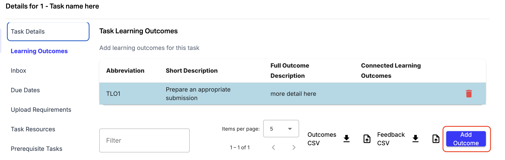
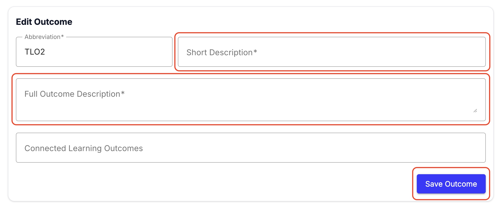
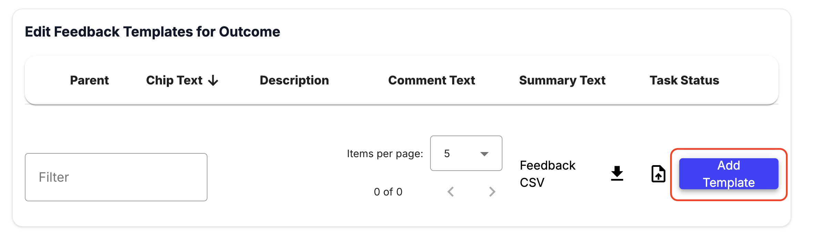
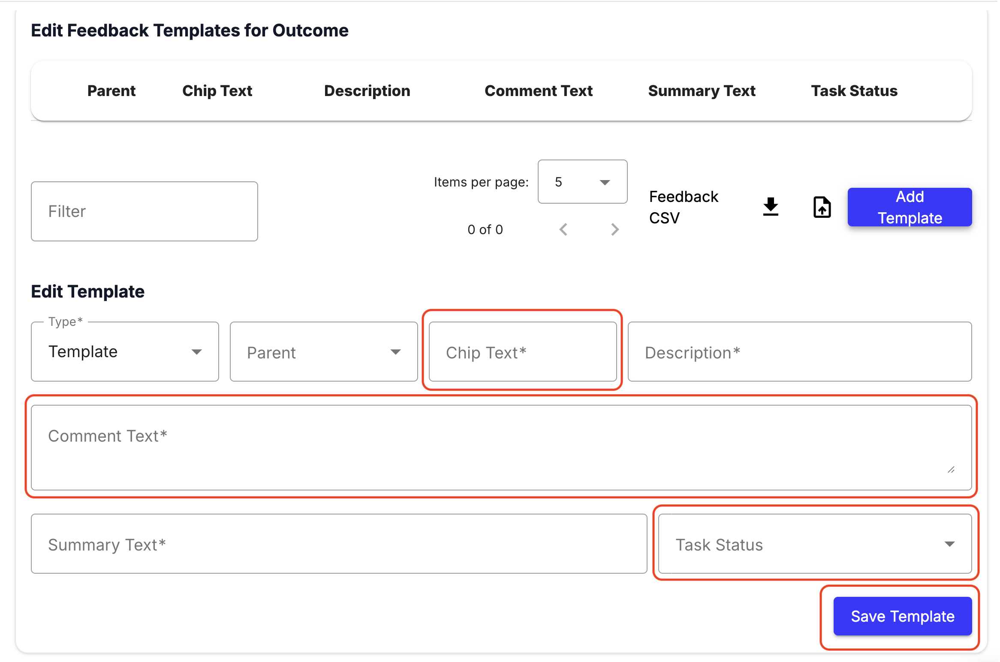

To speed up marking and maintain feedback quality, you can set up pre-written comments for each task.

### Step-by-step instructions

1. Open the task edit page and go to Task Learning Outcomes.
2. Click Add Outcome

3. Add a short description (e.g., "Prepare an appropriate submission") and Full outcome description, and slick Save Outcome

4. In Edit Feedback Templates for Outcome click Add Template

5. Configure canned comments and click Save template
- Chip Text: Brief descriptor for staff (e.g., Incomplete Submission). This will become the label for the button staff can click on to insert the comment.
- Comment Text: The pre-written comment to insert.
- Summary Text: Text that will be used to summarise the feedback if the TA chooses to use the “Summarise feedback” button.
- Task Status: Pre-select a suggested task status if this comment is used (e.g., Fix and Resubmit, Complete, Redo).

6. When marking, TAs can click these pre-configured boxes to instantly insert standardized feedback.

