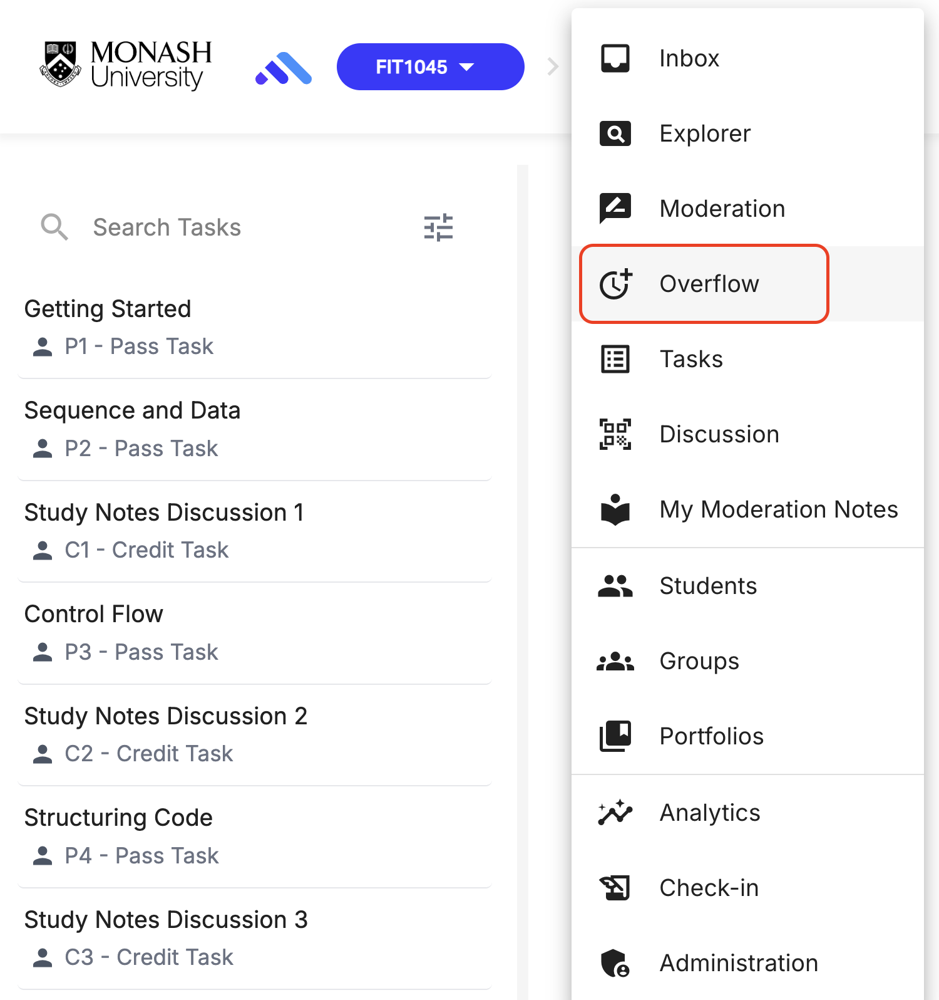
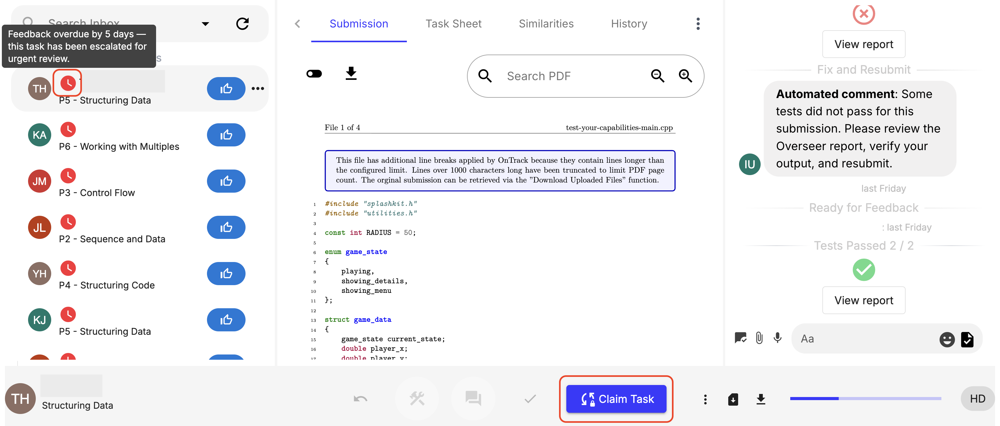

When staff members fall behind or go on leave, overdue tasks automatically transition to the shared Overflow Queue.

### How Overflow Works

When a task submitted for feedback exceeds the configured Overflow Threshold (e.g., 5 days post-submission) the task appears in the shared Overflow Inbox accessible to all staff with Overflow Marking enabled.

### Step-by-step instructions

How to Claim a Task:
1. Navigate to Overflow

1. Select a task from the shared queue and click Claim Task.

3. The task is locked to you for 30 minutes.
4. If feedback is provided and submitted within 30 minutes, the task is complete.
5. If 30 minutes elapse without feedback, the task unlocks and returns to the global pool.

