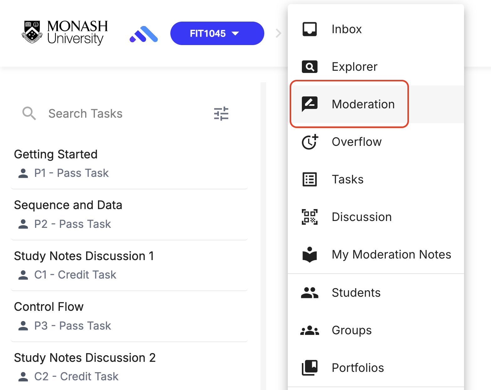
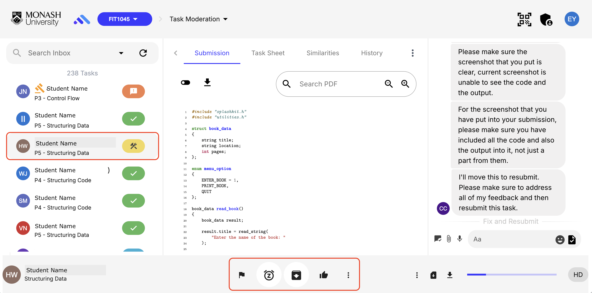
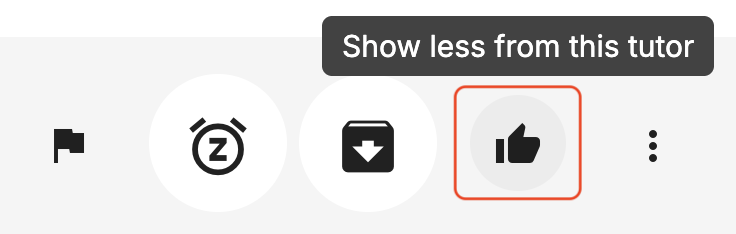
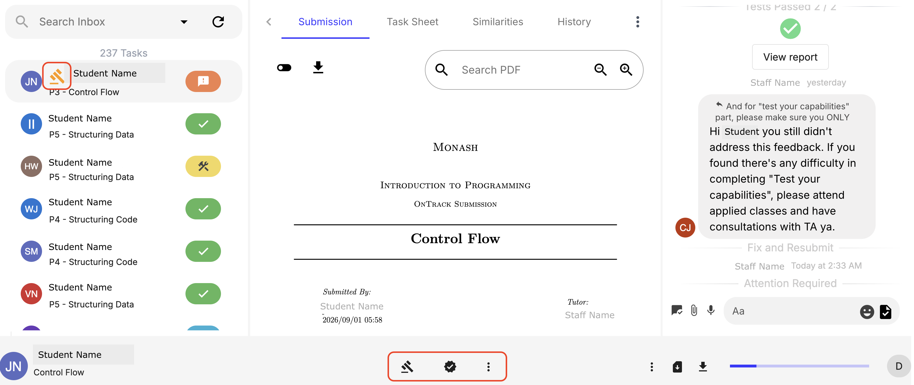
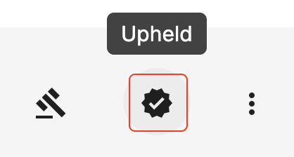
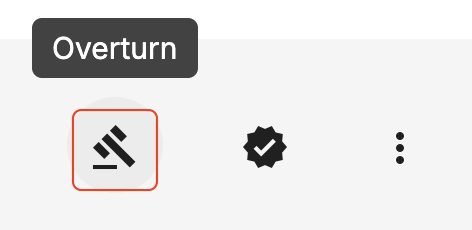

The moderation panel helps Conveners monitor feedback consistency and manage student appeals.

### Mentoring & Moderation Workflow

If you have connected a junior staff member to a mentor in the Staff Settings (see Staff Management and Roles Quickstart guide) random sample submission feedback provided by that TA automatically appears in the mentor’s Moderation Panel.

### Step-by-step instructions

1. Navigate to Moderation

2. Select a task to review

3. You can leave Mod Notes for the TA, which sends direct coaching messages to the TA regarding a specific submission. This triggers an email to the TA and displays an un-dismissible notification icon in OnTrack until acknowledged.

image here

4. You can also choose to see more from this TA if they need more guidance, or less if you are happy with their work.

 

### Student Feedback Escalations

If a student disagrees with TA feedback, they can click Request Feedback Review (represented by a gavel icon).
The submission routes directly to the assigned mentor/convener.

3-Point Escalation System:
Students receive 3 dispute points per semester.
If the convener agrees with the student, the feedback is revised and no points are deducted.
If the convener agrees with the TA, the student loses 1 dispute point.
Reaching 0 points prevents further formal review requests.

### Step-by-step instructions

1. If a task appears in your moderation queue with a gavel icon on it, it is a student dispute query. Select that task.

2. Review the feedback. To agree with the TA click Upheld. To agree with the student, click Overturn.

 

