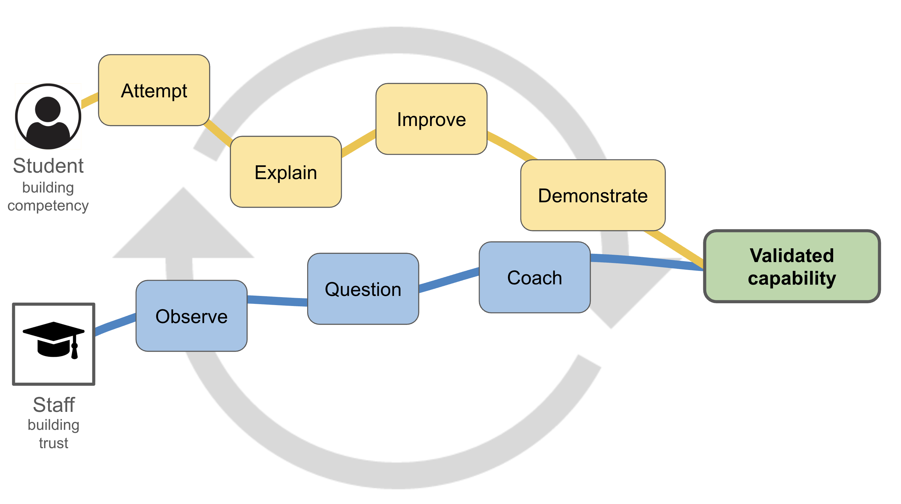

The OnTrack Education Framework is built around five connected pillars: **Mastery**, **Active Tasks**, **Trusted Evidence**, **Reflexivity**, and a **Systematic Holistic Perspective**. Each pillar has a distinct role, and together they shift education away from mark accumulation and product-only judgement toward guided learning, visible achievement, and strong assurance. The framework actively supports students in achieving their learning goals, while empowering staff to build trust in student's capabilities.

## The Learning Journey

Learning sits at the centre of the OnTrack Education Framework. The framework views education as a *learning journey* in which students and staff travel together. Students are responsible for building evidence of their achievement, while educators act as guides, coaches, and validators of their learning.

The journey is designed through a sequence of **active tasks** which students follow. These tasks are deliberately designed and sequenced to engage students in meaningful work, support the development of their capability, and create regular opportunities for feedback and validation. Rather than leaving assessment to the end, the journey incorporates frequent touch points where educators can see learning as it develops and help students move forward.

The framework aims to develop students **holistically**. This means designing for the whole person, not just the coverage of topics. Students are supported to develop the *knowledge*, *skills*, and *dispositions* needed to apply their learning in relevant contexts. By keeping the entire developing person in view, educators can design tasks that build capability, confidence, judgement, and professional ways of thinking and acting, not just understanding of content.

As students engage with active tasks, they produce evidence of their developing capability and submit this for feedback. Through this process, their work becomes **trusted evidence**, because it has not simply been submitted: it has been reviewed, discussed, improved, and validated through staff-student engagement. Task sign-off may involve feedback, discussion, observation, explanation, or revision, depending on what is needed to strengthen confidence in the evidence being produced.

Tasks are designed to be completed well. Students are not rewarded for accumulating partial marks across disconnected activities. Instead, they are supported to demonstrate the required standard. When the evidence is sufficient, staff sign off the task as a validated achievement. When the evidence is not yet sufficient, staff provide guidance and students have the opportunity to respond, revise, and resubmit. This iterative process supports students in building **mastery** of the things that matter.

**Reflexivity** is central to this process. Students learn to treat mistakes, feedback, and revision as part of learning rather than as signs of failure. They are encouraged to value expert advice, sit with discomfort, correct their mistakes, and use feedback to change how they think, act, and demonstrate achievement. In this way, failing becomes part of learning, and feedback becomes a resource for growth.

At the end of the journey, students present their accumulated evidence and show the path they have taken through their studies. The evidence is strengthened by the validations, feedback, discussions, and checkpoints captured along the way. Educators then judge achievement from a **systematic holistic perspective**, looking across the whole body of evidence rather than relying on a single product or isolated performance.

This holistic view brings together the design of the active tasks, the student’s engagement with feedback, the mastery demonstrated in each task, and the staff validations gathered throughout the journey. Together, these provide strong assurance that learning outcomes have been achieved. Final judgements can then be made through a pass/fail lens or through ranked grade achievements, depending on the desired outcomes.

At the heart of this entire journey is a **coaching mindset**: the fundamental belief that every student possesses the drive and capability to achieve mastery. When we prioritise coaching students towards improvement over testing them, a student's learning journey ceases to be a series of hurdles to clear and becomes an intentionally guided path. By approaching every touch point as an invitation for learners to reveal their potential, demonstrate authentic growth, and be guided on the next steps, the journey becomes a true partnership that supports every student to succeed, with the necessary evidence for educators to validate their achievements.

## Each Pillar in Practice

### Mastery

**Mastery** means students must demonstrate the capabilities that matter, in their entirety. The focus is not on accumulating enough marks to pass, but on showing that the required learning outcomes have been achieved.

This changes the starting point for learning design. Instead of asking how many marks an activity should be worth, educators ask what students need to be able to do, explain, apply, or demonstrate. Learning experiences can then be designed around those capabilities.

Mastery does not mean perfection. It means the evidence is strong enough to support confidence that the student has achieved the required standard. What this looks like will vary across disciplines, levels, and degree contexts, but the principle remains the same: important learning should not be averaged away.

### Active Tasks

**Active Tasks** define the path students follow through their learning journey. They are the meaningful things students do to develop, practise, and demonstrate capability.

Active tasks may involve creating, solving, explaining, discussing, analysing, applying, demonstrating, or reflecting. They can be connected to classes, projects, workplace-like activity, or asynchronous learning resources. Their purpose is to engage students in the work of learning, not simply to produce material for marking.

Good active tasks are focused, scaffolded, and deliberately sequenced. Each task should help students move forward, build capability, and generate evidence of learning. Across the learning experience, the tasks should work together as a coherent pathway toward evidencing their mastery.

### Trusted Evidence

**Trusted Evidence** is evidence that gives educators confidence in what students have achieved. A submission by itself is not automatically trusted evidence. It becomes trusted when it is connected to a learning process that makes achievement visible.

This may involve feedback, revision, discussion, observation, demonstration, or explanation being required for task sign-off. The aim is not to interrogate students, but to strengthen the evidence and support their learning. Students should experience validation as part of a supportive educational relationship, not as suspicion.

Different tasks will require different levels of validation. Some may need light-touch feedback. Others may require stronger confirmation through discussion, demonstration, or controlled conditions. The key is to design these touch points strategically so that confidence builds across the journey.

### Reflexivity

**Reflexivity** is the capacity to learn through feedback, mistakes, revision, and change. It asks students to do more than just complete tasks: it asks them to respond to advice, adjust their approach, and improve.

This pillar is central to the idea that failing is part of learning. A mistake is not something to be penalised. Instead, it's a key part of learning, where progress is made visible and growth becomes possible.

Reflexivity also returns feedback to its educational purpose. In the OnTrack Education Framework, feedback is not just an explanation of what was wrong, or a justification of marks. It is expert guidance that students are expected to use. Through this process, students develop resilience, judgement, agency, and the ability to keep improving their own work.

### Systematic Holistic Perspective

A **Systematic Holistic Perspective** means seeing the whole learning journey, not just isolated tasks or individual submissions.

The framework works because its parts are designed to connect. Active tasks structure the journey. Mastery defines the standards. Trusted evidence builds confidence. Reflexivity helps students improve. Staff engagement supports and validates learning along the way.

A holistic perspective matters when designing learning experiences and when judging achievement. Educators should look across the full body of evidence, considering how the student has engaged, responded, improved, and demonstrated capability over time. Final judgement is therefore not dependent on a single product or moment. It is supported by the pattern of evidence built across a student's entire journey.

## A Coaching Mindset

The **Coaching Mindset** calls educators to focus on formative feedback, and the belief that every student possesses the drive and capability to achieve mastery with the right support.

Pushing students to achieve mastery requires supportive and caring educators. Students need to see the opportunities offered, and a coaching mindset helps ensure the journey does not just become a series of obstacles or hurdles to overcome. Educators need to position themselves alongside their students, helping guide and support them as they progress through the active tasks that define their journey. Feedback is formative, actionable, and encouraging, helping guide student's development of mastery and supporting them while also ensuring that the required standards are met.

Taken together, these pillars make assessment more than a mechanism for grading. They make it a system for supporting learning and assuring achievement with confidence.
